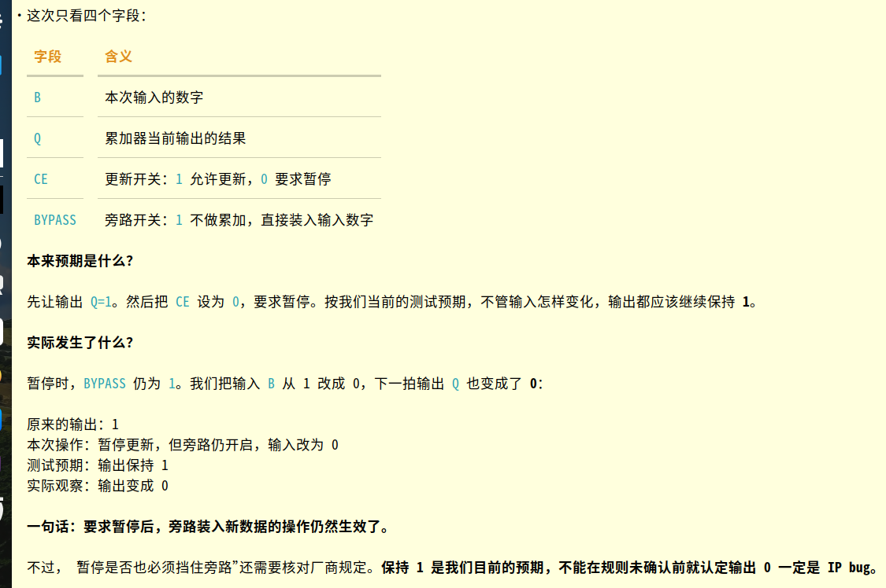
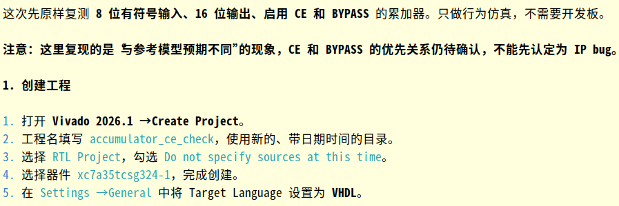
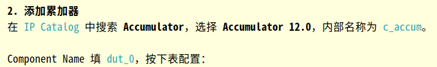
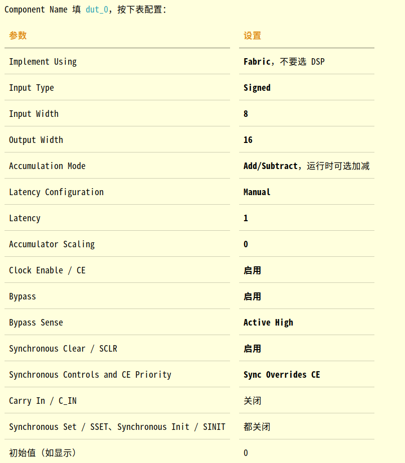
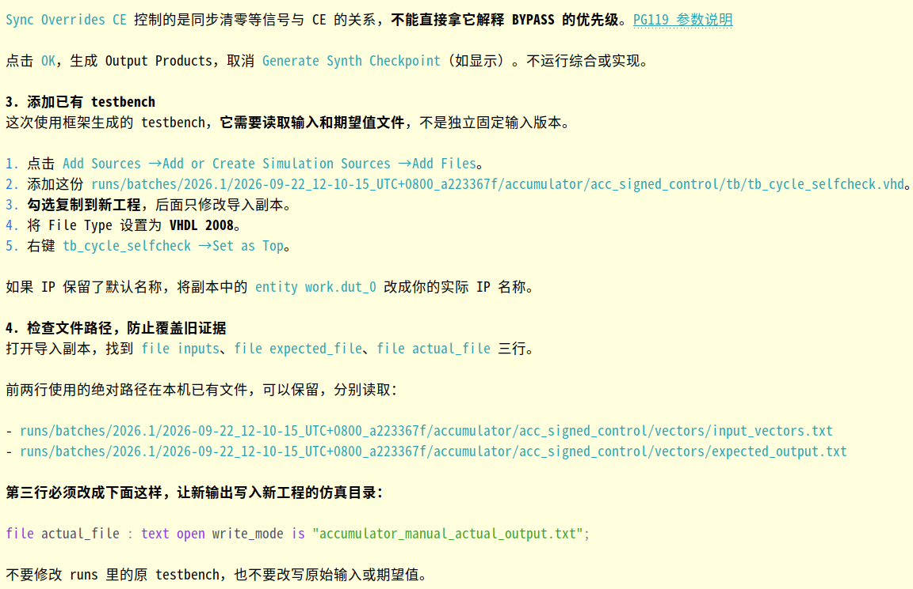
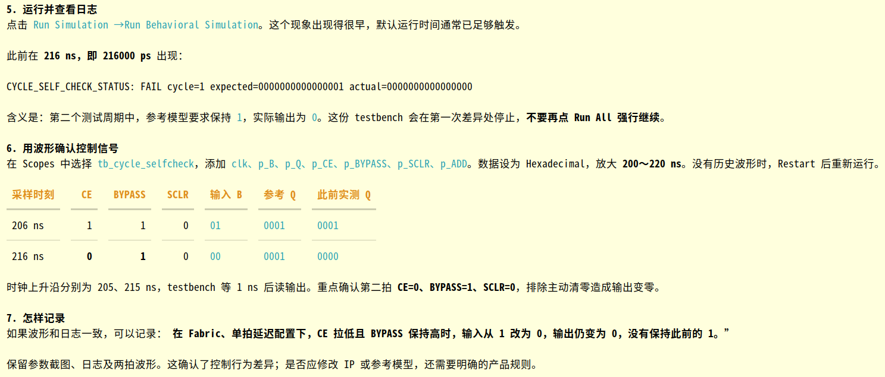
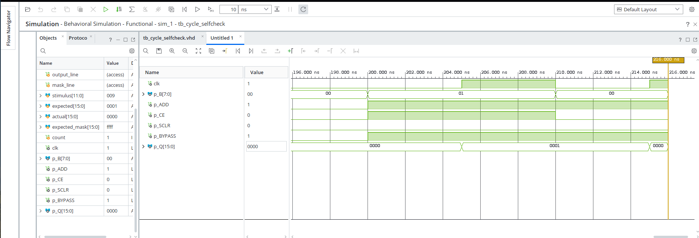

accumulator_ce_check

xc7a35tcsg324-1

Accumulator

dut_0

file actual_file

file actual_file : text open write_mode is "accumulator_manual_actual_output.txt";

run all
Failure: CYCLE_SELF_CHECK_STATUS: FAIL cycle=1 expected=0000000000000001 actual=0000000000000000
Time: 216 ns  Iteration: 0  Process: /tb_cycle_selfcheck/stimulus_and_checker  File: /home/dpc/accumulator_ce_check/accumulator_ce_check.srcs/sim_1/imports/tb/tb_cycle_selfcheck.vhd
$finish called at time : 216 ns : File "/home/dpc/accumulator_ce_check/accumulator_ce_check.srcs/sim_1/imports/tb/tb_cycle_selfcheck.vhd" Line 82

