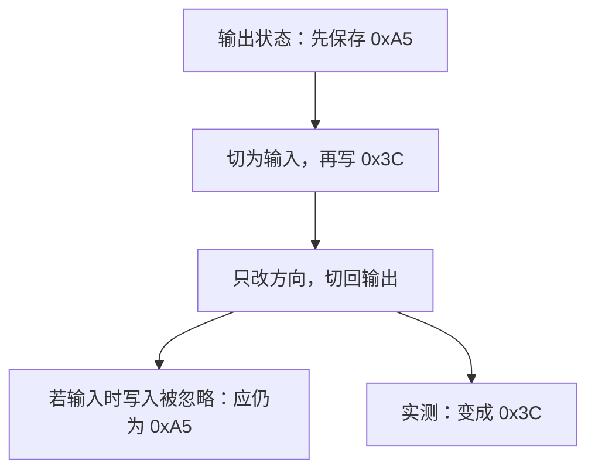

# AXI GPIO：输入状态下写入的数据，切回输出后生效了

测试先把 GPIO 设为输入，再往数据寄存器写 `0x3C`，最后切回输出。
实测输出数据变成 `0x3C`。如果手册中的“输入时写入无效”表示忽略这次写入，
切回输出后就应该保留此前的 `0xA5`。

## 先弄清输入、输出和方向

GPIO 是通用数字输入/输出。以 8 位 GPIO 为例，它能控制或读取 8 根数字信号线。
方向寄存器 `GPIO_TRI` 的每一位决定对应信号线的方向：
1 是输入，0 是输出。因此 `0xFF` 是全输入，`0x00` 是全输出。

生成 IP 后，仿真里看到的是三组信号：

| 端口 | 含义 |
| --- | --- |
| `gpio_io_i` | 从外部读进来的值 |
| `gpio_io_o` | IP 准备向外输出的数据 |
| `gpio_io_t` | 方向控制；对应位为 1 时，外部输出驱动应关闭 |

即使 `gpio_io_o` 有一个数，当 `gpio_io_t=0xFF` 时，也不能说
“IP 正在把这个数驱动到外部引脚”。本 testbench 直接观察这些逻辑端口，
没有接实际板卡。

## 独立 VHDL 是怎么做的

使用 Vivado 2026.1，单通道、8 位双向 GPIO，关闭中断。
复位后方向为全输入，外部输入 `gpio_io_i` **始终固定为 0**。

| 顺序 | 写入操作 | IP 输出数据端口 | 方向 | 数据寄存器读回 |
| --- | --- | --- | --- | --- |
| 1 | 设为输出，写 `0xA5` | `0xA5` | 全输出 | `0xA5` |
| 2 | 设为输入，再写 `0x3C` | `0x3C` | 全输入 | 0 |
| 3 | 只切回输出，没有再次写数据 | `0x3C` | 全输出 | `0x3C` |

日志里的 `pins` 字段记录的是 `gpio_io_o`，不是外部输入。
上表读回值是此次实测记录，不能据此给所有 GPIO 读回行为下结论。

[PG144 的数据寄存器说明](https://docs.amd.com/r/en-US/pg144-axi-gpio/AXI-GPIO-Data-Register-GPIOx_DATA)
说输入方向下写数据没有作用。待确认的是：这里是否应禁止更新内部输出寄存器，
还是仅表示输入状态时不驱动引脚。上面的第 3 步专门用来区分这两种解释。

## 另外五组相关失败配置

整批自检中，还有以下五组双通道配置在“先写数据，再改方向”的序列中
首次出现输出差异。五组均开启中断，还未分别做固定输入的独立复现。

| 配置 | 通道 1 | 通道 2 | 首次差异涉及的方向寄存器 |
| --- | --- | --- | --- |
| `gpio_dual_bidir_bidir` | 双向，7 位 | 双向，31 位 | `0x04`，通道 1 |
| `gpio_dual_bidir_in` | 双向，7 位 | 固定输入，31 位 | `0x04`，通道 1 |
| `gpio_dual_bidir_out` | 双向，7 位 | 固定输出，1 位 | `0x04`，通道 1 |
| `gpio_dual_in_bidir` | 固定输入，32 位 | 双向，31 位 | `0x0C`，通道 2 |
| `gpio_dual_out_bidir` | 固定输出，7 位 | 双向，31 位 | `0x0C`，通道 2 |

“固定输入/输出”是生成时限定方向；“双向”才允许运行时逐位改变方向。
对应的复位初值也全部列在这里：

| 配置 | 通道 1 数据 / 方向初值 | 通道 2 数据 / 方向初值 |
| --- | --- | --- |
| `gpio_dual_bidir_bidir` | `0x55 / 0x2A` | `0x55555555 / 0x2AAAAAAA` |
| `gpio_dual_bidir_in` | `0x55 / 0x2A` | `0 / 0` |
| `gpio_dual_bidir_out` | `0x55 / 0x2A` | `1 / 0` |
| `gpio_dual_in_bidir` | `0 / 0` | `0x55555555 / 0x2AAAAAAA` |
| `gpio_dual_out_bidir` | `0x55 / 0` | `0x55555555 / 0x2AAAAAAA` |

这些初值用于覆盖不同位的状态。比如 7 位方向 `0x2A` 是 `0101010`，
意味着部分位为输入、部分位为输出。暂时把五组列作相关线索，
还不能保证每组都有同一个内部原因。

[独立 VHDL](../../../tests/fixtures/ip/axi_gpio/tb_register_probe.vhd)、
[逐步观测](../../../evidence/vivado_2026_1/observations/2026-09-22_12-14-26_UTC+0800_00f9d856/axi_gpio/observations.json)
和[日志](../../../evidence/vivado_2026_1/observations/2026-09-22_12-14-26_UTC+0800_00f9d856/axi_gpio/simulate.process.log)
可核对前三步；五组参数与状态见[整批报告](../../../evidence/vivado_2026_1/full_regression/2026-09-22_12-47-30_UTC+0800_4bca4f69/report.csv)。
