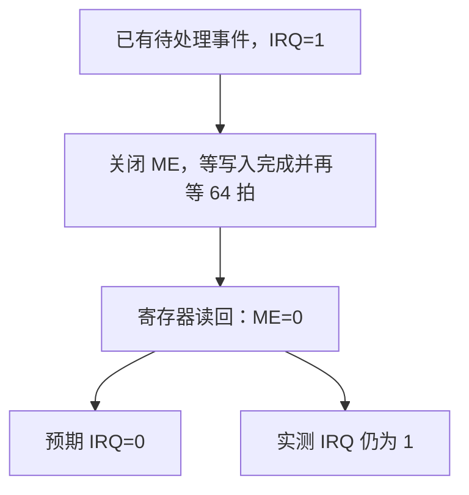

# AXI INTC：主使能已经关闭，IRQ 仍保持有效

Vivado 2026.1 中，先让中断输出 IRQ 变为 1，再关闭主使能 ME。
寄存器读回确认 ME 已经是 0，但 IRQ 仍为 1。

## 先分清“有事待处理”和“是否发出通知”

AXI INTC 用来收集外设的中断请求，再通知处理器。
ISR 记录“哪些事还没处理”；IER 决定每一路能否通知处理器；
ME 是总使能，IRQ 是最后发出去的通知信号。

本次使用高电平有效的单路中断、不启用优先级阈值。
在这组简单条件下，可以把预期关系理解成：

```text
IRQ 应有效 = 有待处理事件，并且该路 IER 开启，并且 ME 开启
```

关闭 ME 不必清掉 ISR 中的待处理事件，但应停止对外通知。
[PG099 的 MER 说明](https://docs.amd.com/v/u/en-US/pg099-axi-intc)也明确写明，
向 ME 写 0 会关闭 IRQ 输出。

## 本次参数

| 参数 | 值 | 作用 |
| --- | --- | --- |
| `C_NUM_INTR_INPUTS` | 1 | 只有一根硬件中断输入 |
| `C_NUM_SW_INTR` | 0 | 不配置专用软件中断 |
| 触发方式 | 上升沿 | 输入从 0 变 1 时产生事件 |
| 异步输入 | 关闭 | 本次输入与测试时钟协调驱动 |
| ILR / Fast | 都关闭 | 不使用优先级阈值和快速中断模式 |
| 工具与 IP | Vivado 2026.1，修订号 23 | 独立 VHDL 行为仿真 |

同一参数组分别用预编译库和直接编译的厂商 HDL 跑过，
两次都观察到差异。这是两种运行方式，不是两组不同参数。

## 完整操作顺序

MER 寄存器的最低两位是 `HIE、ME`。
HIE 控制是否使用真实硬件输入，开启后会保持到复位。
所以向 MER 写 0 后读回 2（二进制 `10`）是可以解释的：
HIE 仍为 1，ME 已经为 0。

| 步骤 | 做了什么 | 应看到什么 | 实际 |
| --- | --- | --- | --- |
| 1 | 复位，开启该路 IER，向 MER 写 3（`11`） | 没有事件，IRQ=0 | 符合 |
| 2 | 硬件输入产生一次上升沿，再回到 0 | ISR=1，IRQ=1 | 符合 |
| 3 | 向 MER 写 0 | 读回 MER=2；ISR 可保留；IRQ 应变 0 | MER=2、ISR=1，但 IRQ=1 |
| 4 | 向 IER 写 0，屏蔽该路 | IRQ=0 | 符合 |
| 5 | 保持 ME=0，再开启 IER | IRQ 仍为 0 | 符合 |
| 6 | 重新开启 ME | 旧事件尚未清除，IRQ=1 | 符合 |

关键是第 3 步。testbench 在写入完成后等待了 64 个时钟周期再读取，
并非写入的同一瞬间就要求看到变化。



## 这个差异可能影响什么

如果系统靠关闭 ME 暂停中断通知，这种保持行为可能让处理器仍看到中断请求。
本次只证明行为模型在这条操作路径上的表现，尚未证明板上硬件也一样。

测试还覆盖了清除事件、ME 关闭期间产生新事件、重新开启以及复位等对照。
这些对照帮助说明：ME 不是完全不起作用，差异集中在“IRQ 已经有效时再关 ME”。

这段测试没有写 ISR，因此与 [ISR 写入丢失旧位](isr_write_issue.md)分别记录。
[独立 VHDL](../../../tests/fixtures/ip/axi_intc/tb_master_enable_probe.vhd)、
[预编译库观测](../../../evidence/vivado_2026_1/observations/2026-09-22_12-16-56_UTC+0800_61892d25/axi_intc/me_precompiled_summary.json)
和[原始 HDL 观测](../../../evidence/vivado_2026_1/observations/2026-09-22_12-17-16_UTC+0800_f6f38e7c/axi_intc/me_fresh_source_summary.json)
列出每步读回和 IRQ 值。
