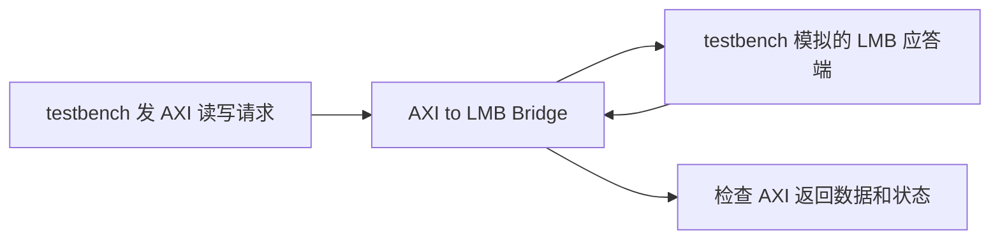

# AXI to LMB Bridge：已查明是测试端应答早了一拍

2026-09-23 已完成排查。这条不再作为 IP bug 候选。
两组配置原先各有 6 行数据差异、1 行响应差异，原因是我们模拟的 LMB 应答端
没有遵守 Frequency 模式的读时序。修正测试端后，两组原输入、原期望值全部通过。
IP 参数和 Python 数值参考没有改。

## 桥接器做什么

AXI 和 LMB 是两套传输请求、数据和应答的接口规则。
LMB 常用于 MicroBlaze 的本地存储访问。
AXI to LMB Bridge 接收 AXI 侧的读写请求，转换成 LMB 侧能理解的操作，
再把结果送回 AXI 一侧。

它不做乘法或滤波。这里检查的是：请求地址有没有传对、读回数据有没有对应上，
以及遇到错误时有没有报告正确状态。



图中两端都由 testbench 驱动和观察，所以发现差异后也要检查应答端的实现，
不能只凭比较失败就确定桥接器错了。

## 原先失败的全部两组配置

| 参数 | 含义 | `axi_lmb_bridge_frequency_40` | `axi_lmb_bridge_pause_64` |
| --- | --- | --- | --- |
| 地址位宽 | 用多少位指定访问位置 | 40 | 64 |
| 数据位宽 | 一笔数据最多有多少位 | 32，即 4 字节 | 64，即 8 字节 |
| ID 位宽 | 请求编号用多少位，帮助对应返回结果 | 8 | 16 |
| LMB 协议选项 | 选择接口处理时序 | Frequency | Frequency |
| protection | 带访问保护信息，例如权限属性 | 开启 | 开启 |
| use_pause | 带暂停请求及应答功能 | 关闭 | 开启 |

安装包给 `Frequency` 的说明是配合频率优化的 MicroBlaze 改善时序。
它是协议选项，不是把时钟频率设为某个数值。
两组还共用写地址/读地址队列深度 2，写数据/读数据队列深度 8；
这些队列用来暂存尚未完成的请求和数据。

## 参考值从哪里来

测试的 LMB 应答端根据地址生成可预测的字节，不依赖真实板上内存。
当前参考对第 k 个字节采用：

```text
字节值 = (地址 + 49×k) 除以 256 的余数
```

k 从 0 开始，k=0 放在最低字节。
例如地址末字节为 `0xF0` 时，4 个字节依次为
`F0、21、52、83`，组合成 32 位数就是 `0x835221F0`。
这是测试自己选的应答规律，不是 LMB 协议规定的数据计算公式。

## 原先哪里不同

下面从报告保存的二进制输出行中，按 `data` 字段位置取出数值：

| 配置 | 首次差异输出序号 | 参考数据 | 实际数据 |
| --- | ---: | --- | --- |
| `axi_lmb_bridge_frequency_40` | 3 | `0x835221F0` | `0x875625F4` |
| `axi_lmb_bridge_pause_64` | 3 | `0x4716E5B4835221F0` | `0x4B1AE9B8875625F4` |

两组各有 6 行数据不符，另外都在输出序号 19 出现：

| 字段 | 参考期望 | 实际 |
| --- | --- | --- |
| resp，应答状态 | 2，表示错误响应 | 0，表示成功响应 |

序号从 0 开始，数的是保存下来的输出行；一次请求可能产生多行，
所以“输出序号 3”不能直接当作“第三笔请求”。

## 原因是什么

通俗地说：桥接器说“下一拍我来取这笔读数据”，测试端却提前把这笔数据换成了
下一笔；遇到读错误时，也提前把错误标记撤掉了。桥接器因此拿到了错误的数据，
或者错过了错误标记。这不能归咎于桥接器。

| LMB 模式 | 桥接器取读数据和读错误标记的时刻 |
| --- | --- |
| Standard | 采到 `LMB_Ready=1` 的这一拍 |
| Frequency | 采到 `LMB_Ready=1` 后的下一拍 |

`LMB_Ready` 表示本次访问已就绪，`LMB_ReadDBus` 是返回的数据，
`LMB_UE` 表示不可纠正错误。写错误仍与 Ready 同拍，不能把所有错误信号一律后移。

安装目录中的厂商源模型直接说明并实现了这个差别：
`/data/Xilinx/2026.1/Vivado/data/ip/xilinx/axi_lmb_bridge_v1_0/hdl/axi_lmb_bridge_v1_0_rfs.vhd`。
其中 1112–1134 行按 `C_LMB_PROTOCOL` 选择同拍或延后一拍读响应；
1047–1058 行单独处理写错误。本次结论结合了这段模型和实际对照仿真，
不是仅根据“修改后通过”猜测原因。

还核对了另一端的厂商 LMB BRAM Controller 模型：同一安装目录下
`lmb_bram_if_cntlr_v4_0/hdl/lmb_bram_if_cntlr_v4_0_rfs.vhd` 的 5636–5657 行
对 Frequency 读数据增加一级寄存器，6402–6416 行说明读 UE、CE 也晚一拍。
这与 Bridge 的接收时序一致；本次只阅读该控制器源码，没有另外运行两核互连仿真。
[UG984 的通用 LMB 信号说明](https://docs.amd.com/r/en-US/ug984-vivado-microblaze-ref/LMB-Signal-Interface)
写的是 Ready 与数据同拍，没有在该页展开 Frequency 差别。因此这里明确区分模式，
不把通用描述直接用于 Frequency，也不把它称为厂商对本次 issue 的正式回复。

框架原模板虽声明了 `FREQUENCY_PROTOCOL`，却没有使用它。
现在只把 Frequency 模式的读数据和读 UE 延后一拍，写 UE 保持原时序。
比较时仍逐位检查数据、ID、响应和包尾，没有忽略错误位。

## 修改前后怎么确认

| 对照 | 结果 |
| --- | --- |
| 用旧测试端重跑两组原配置 | 每组仍有 6 行数据差异、1 行响应差异 |
| 用修正后的测试端重跑，输入和期望文件不变 | 两组均 PASS |
| 全部 5 组 Bridge 常用配置 | 15 个阶段全部 PASS |
| 固定请求分别跑 Standard、Frequency | 两种模式均得到下面的结果 |

固定请求使用 32 位数据、32 位地址、1 位 ID，关闭保护和 Pause，队列深度仍为
AW=2、W=8、AR=2、R=8。只改变协议模式，不依赖 Python 参考模型算期望值：

| 操作 | 返回数据 | 响应 |
| --- | --- | --- |
| 从 `0xF0` 连读两拍 | `0x835221F0`、`0x875625F4` | 都为 0，成功 |
| 读 `0x2C0`，应答端注入 UE | `0x5322F1C0` | 2，错误 |
| 写 `0x2D0`，应答端注入 UE | 不适用 | 2，错误 |
| 随后正常写 `0x2E0` | 不适用 | 0，成功 |
| 随后正常读 `0x2F0` | `0x835221F0` | 0，成功 |

固定请求测试复用框架的总线驱动，期望值是另行写死的常量；不是完全独立的 VHDL 驱动。
这排除了本次已观察到的差异，不代表 Bridge 的所有参数和访问组合都已验证。

## 复跑与证据

```bash
source /data/Xilinx/2026.1/Vivado/settings64.sh
python3 scripts/run_all.py --ip-type axi_lmb_bridge
VIVADO_INTEGRATION=1 PYTHONPATH=src:tests python3 -m unittest \
  integration.ip.axi_lmb_bridge.test_frequency_response -v
```

本次[修改前报告](../../../evidence/vivado_2026_1/axi_lmb_bridge/protocol_review/2026-09-23_16-16-05_UTC+0800_21e595ba/report.json)、
[修改后报告](../../../evidence/vivado_2026_1/axi_lmb_bridge/protocol_review/2026-09-23_16-17-52_UTC+0800_46625706/report.json)、
[固定请求对照](../../../evidence/vivado_2026_1/axi_lmb_bridge/protocol_review/2026-09-23_16-21-05_UTC+0800_3848c404/)
已公开归档，各配置下都有 testbench、参数、实际输出和创建/仿真日志。

以下是最初发现差异时的历史记录，保留原样，不改成 PASS：

[40 位地址失败详情](../../../evidence/vivado_2026_1/full_regression/2026-09-22_12-47-30_UTC+0800_4bca4f69/axi_lmb_bridge/frequency_40_failure.json)
和[64 位地址失败详情](../../../evidence/vivado_2026_1/full_regression/2026-09-22_12-47-30_UTC+0800_4bca4f69/axi_lmb_bridge/pause_64_failure.json)
列出全部差异分布；
[第一组请求](../../../evidence/vivado_2026_1/full_regression/2026-09-22_12-47-30_UTC+0800_4bca4f69/axi_lmb_bridge/frequency_40_operations.json)
和[第二组请求](../../../evidence/vivado_2026_1/full_regression/2026-09-22_12-47-30_UTC+0800_4bca4f69/axi_lmb_bridge/pause_64_operations.json)
用于继续逐笔排查。
