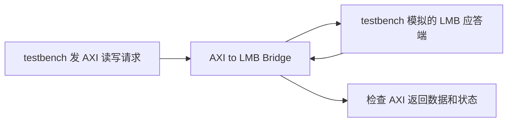

# AXI to LMB Bridge：返回的数据和错误响应与参考不一致

Vivado 2026.1 的两组配置都出现 6 行数据差异和 1 行响应差异。
目前已有具体的期望值和实际值，但还没有把它们缩减为独立固定请求复现。

## 桥接器做什么

AXI 和 LMB 是两套传输请求、数据和应答的接口规则。
LMB 常用于 MicroBlaze 的本地存储访问。
AXI to LMB Bridge 接收 AXI 侧的读写请求，转换成 LMB 侧能理解的操作，
再把结果送回 AXI 一侧。

它不做乘法或滤波。这里检查的是：请求地址有没有传对、读回数据有没有对应上，
以及遇到错误时有没有报告正确状态。



图中两端都由 testbench 驱动和观察，所以发现差异后也要检查应答端的实现，
不能只凭比较失败就确定桥接器错了。

## 全部两组失败配置

| 参数 | 含义 | `axi_lmb_bridge_frequency_40` | `axi_lmb_bridge_pause_64` |
| --- | --- | --- | --- |
| 地址位宽 | 用多少位指定访问位置 | 40 | 64 |
| 数据位宽 | 一笔数据最多有多少位 | 32，即 4 字节 | 64，即 8 字节 |
| ID 位宽 | 请求编号用多少位，帮助对应返回结果 | 8 | 16 |
| LMB 协议选项 | 选择接口处理时序 | Frequency | Frequency |
| protection | 带访问保护信息，例如权限属性 | 开启 | 开启 |
| use_pause | 带暂停请求及应答功能 | 关闭 | 开启 |

安装包给 `Frequency` 的说明是配合频率优化的 MicroBlaze 改善时序。
它是协议选项，不是把时钟频率设为某个数值。
两组还共用写地址/读地址队列深度 2，写数据/读数据队列深度 8；
这些队列用来暂存尚未完成的请求和数据。

## 参考值从哪里来

测试的 LMB 应答端根据地址生成可预测的字节，不依赖真实板上内存。
当前参考对第 k 个字节采用：

```text
字节值 = (地址 + 49×k) 除以 256 的余数
```

k 从 0 开始，k=0 放在最低字节。
例如地址末字节为 `0xF0` 时，4 个字节依次为
`F0、21、52、83`，组合成 32 位数就是 `0x835221F0`。
这是测试自己选的应答规律，不是 LMB 协议规定的数据计算公式。

## 实际哪里不同

下面从报告保存的二进制输出行中，按 `data` 字段位置取出数值：

| 配置 | 首次差异输出序号 | 参考数据 | 实际数据 |
| --- | ---: | --- | --- |
| `axi_lmb_bridge_frequency_40` | 3 | `0x835221F0` | `0x875625F4` |
| `axi_lmb_bridge_pause_64` | 3 | `0x4716E5B4835221F0` | `0x4B1AE9B8875625F4` |

两组各有 6 行数据不符，另外都在输出序号 19 出现：

| 字段 | 参考期望 | 实际 |
| --- | --- | --- |
| resp，应答状态 | 2，表示错误响应 | 0，表示成功响应 |

序号从 0 开始，数的是保存下来的输出行；一次请求可能产生多行，
所以“输出序号 3”不能直接当作“第三笔请求”。

数据差异看起来可能与地址或采样时刻有关，但报告标明
`input_mapping_available=false`：尚未自动对应到具体输入请求。
接下来必须还原这几行输出对应的请求，分别核对地址、应答时序和参考逻辑。
当前结论是两组配置的自检失败，内部原因未定。

[40 位地址失败详情](../../../evidence/vivado_2026_1/full_regression/2026-09-22_12-47-30_UTC+0800_4bca4f69/axi_lmb_bridge/frequency_40_failure.json)
和[64 位地址失败详情](../../../evidence/vivado_2026_1/full_regression/2026-09-22_12-47-30_UTC+0800_4bca4f69/axi_lmb_bridge/pause_64_failure.json)
列出全部差异分布；
[第一组请求](../../../evidence/vivado_2026_1/full_regression/2026-09-22_12-47-30_UTC+0800_4bca4f69/axi_lmb_bridge/frequency_40_operations.json)
和[第二组请求](../../../evidence/vivado_2026_1/full_regression/2026-09-22_12-47-30_UTC+0800_4bca4f69/axi_lmb_bridge/pause_64_operations.json)
用于继续逐笔排查。
