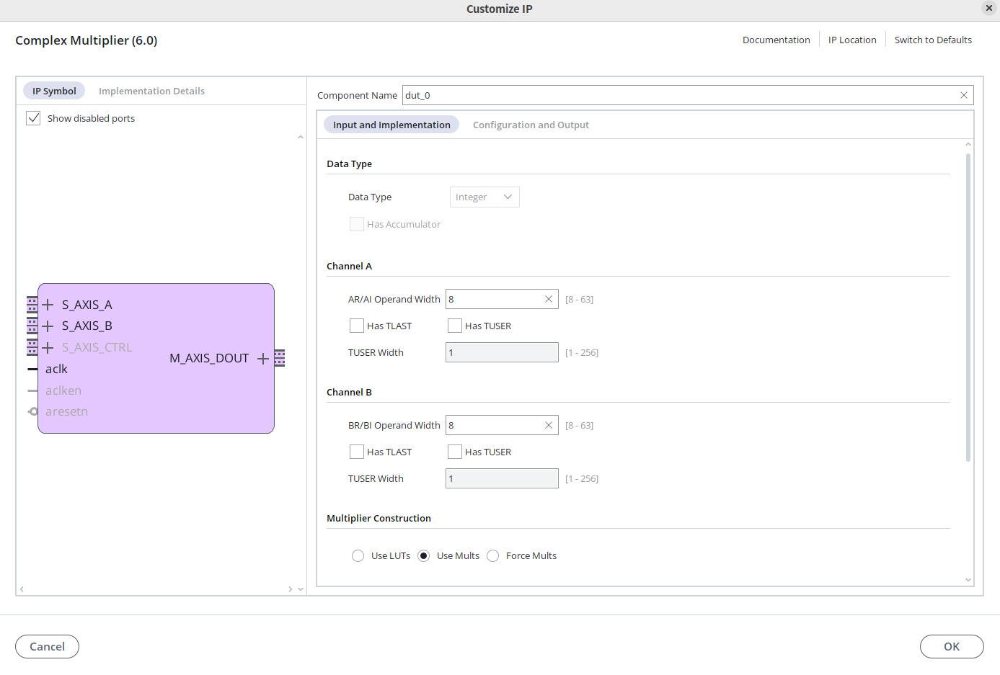
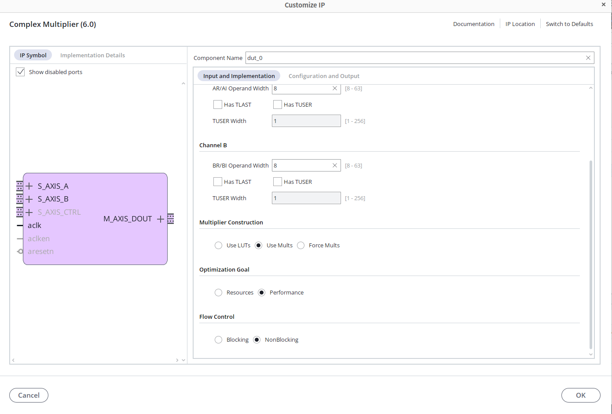
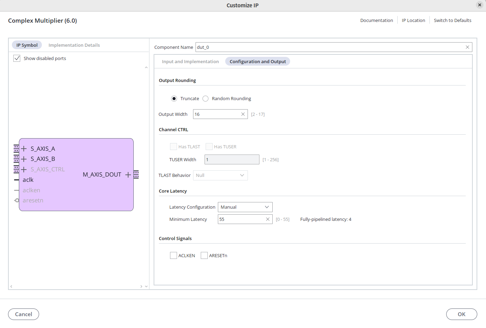
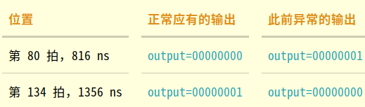
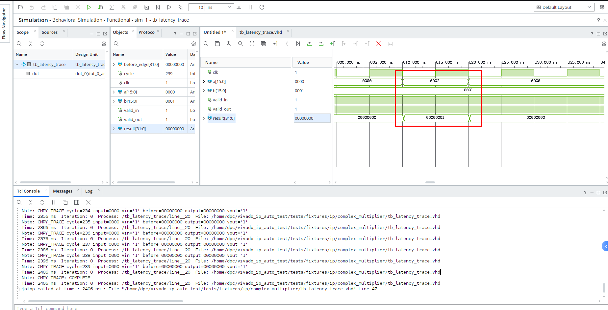
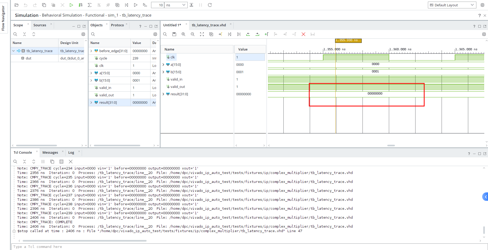
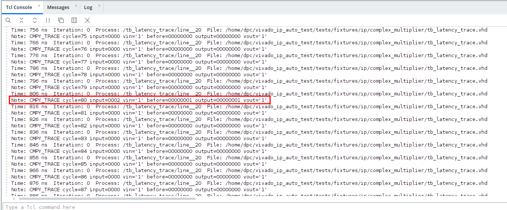
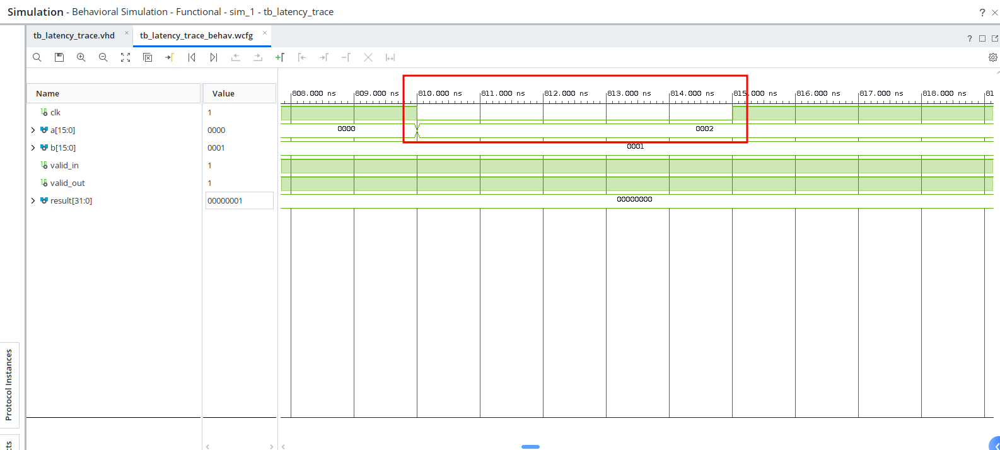
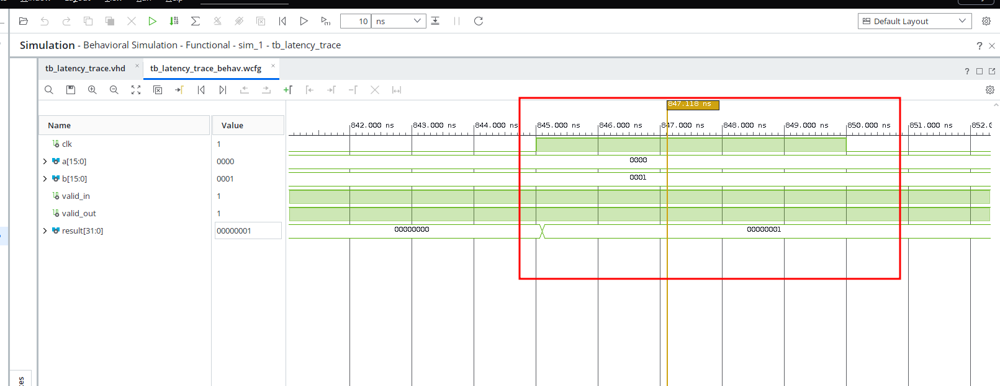

下面先复现 55 拍配置，再改成 4 拍配置做对照。全程只运行行为仿真，不需要开发板、约束文件、综合或实现。

## 创建项目

1. 打开 Vivado 2026.1，通过 Help → About 确认版本。
2. 点击 Create Project，项目名填写 cmul_latency55，放到新目录，目录名带上本次日期和时间，不使用旧测试工程。
3. 选择 RTL Project，勾选 Do not specify sources at this time。
4. 在 Default Part → Parts 中搜索并选择 xc7a35tcsg324-1，然后完成创建。这与已有复现使用的器件一致。

## 添加并配置 IP

1. 左侧点击 IP Catalog，搜索 Complex Multiplier，双击打开。按下面设置，部分选项分布在不同标签页中：

2. 项目                                  设置
   ━━━━━━━━━━━━━━━━━━━━━━━━━━━━━━━━━━━━━━
   Component Name                        dut_0，必须与 testbench 中的名字一致
   ──────────────────────────────────────
   Data Type                             Integer
   ──────────────────────────────────────
   Accumulator（如显示）                 不启用
   ──────────────────────────────────────
   Channel A 的输入位宽                  8
   ──────────────────────────────────────
   Channel B 的输入位宽                  8
   ──────────────────────────────────────
   Multiplier Construction / MultType    使用乘法器，Use_Mults，不要选 LUT
   ──────────────────────────────────────
   Optimization                          Performance
   ──────────────────────────────────────
   Flow Control                          NonBlocking
   ──────────────────────────────────────
   Output Width                          16，指每个输出分量的位宽
   ──────────────────────────────────────
   Output Rounding                       Truncate
   ──────────────────────────────────────
   Latency Configuration                 Manual
   ──────────────────────────────────────
   Minimum Latency                       55
   ──────────────────────────────────────
   ACLKEN、ARESETN                       都不启用
   ──────────────────────────────────────
   A、B、CTRL 的 TLAST、TUSER            全部不启用
   ──────────────────────────────────────
   Output TLAST Behavior（如可选）       Null

   ──────────────────────────────────────

3.   注意：不是将两个输入各设为 16 位。每个输入的实部和虚部各 8 位，合在一起才是 16 位端口。官方说明手动长延迟应通过附加延迟单元实现，并非可以忽略的参数。

4.   点击 OK，生成 Output Products。若出现 Generate Synth Checkpoint，取消勾选；不要启动综合。若已关掉生成窗口，可在 Sources 中右键 dut_0，选择 Generate Output Products。

   

   

   

## 添加 testbench

1. 点击 Add Sources → Add or Create Simulation Sources，注意不是 Design Sources。
2. 点击 Add Files，选择现有的 tests/fixtures/ip/complex_multiplier/tb_latency_trace.vhd。可勾选复制到项目，保持此次复测独立。
3. 完整路径是 /home/dpc/vivado_ip_auto_test/tests/fixtures/ip/complex_multiplier/tb_latency_trace.vhd。不要选旧的 tb_latency_55_probe.vhd，旧文件会遇错退出。
4. 添加后，在 Simulation Sources 中选中文件，在 Source File Properties 中将 File Type 设置为 VHDL 2008。
5. 右键 tb_latency_trace，选择 Set as Top。测试顶层不是 dut_0，也不需要另外写顶层连接文件。

## 启动并跑完仿真

点击 Run Simulation → Run Behavioral Simulation。进入仿真界面后，若只运行到默认的 1000 ns，点击 Run All 继续，直到约 2406 ns。
  控制台应该出现 CMPY_TRACE: COMPLETE。它只表示记录完整，不是功能通过；这份 testbench 不会因为观察到错误就提前停止。

## 看波形，确认是否复现

在 Scopes 中选择顶层 tb_latency_trace，将 clk、a、b、valid_in、result、valid_out 添加到波形。将 a、b、result 的显示方式设为 Radix → Hexadecimal。
  如果新加信号没有历史波形，点击 Restart，再 Run All。

信号                   含义
 ━━━━━━━━━━━━━━━━━━━━━━━━━━━━━━━━━━━━━━━━
   a、b                   两路输入，高 8 位为虚部，低 8 位为实部
────────────────────────────────────────
   result                 输出，高 16 位为虚部，低 16 位为实部

────────────────────────────────────────

   valid_in、valid_out    输入、输出是否有效

────────────────────────────────────────

  先放大 800～830 ns，再检查 1356 ns。以下时间对应这份 testbench，周期编号从 0 开始：

   时间                      应观察什么                正常 55 拍配置    此前发现的异常
━━━━━━━━━━━━━━━━  ━━━━━━━━━━━━━━━━━━
   810 ns                    a 变成 0002，b=0001       输出仍应为零      输出已随输入变化
 ────────────────  ──────────────────
   816 ns，第 80 拍采样      result，且 valid_out=1    00000000          00000001
────────────────  ──────────────────
   1356 ns，第 134 拍采样    result，且 valid_out=1    00000001          00000000

────────────────  ──────────────────

  

这里 2×1 输出为 1 是配置的截断效果，不是本次问题。问题是这个 1 出现在错误的时间，而应该出现时却输出了零。 控制台搜索 CMPY_TRACE cycle=80 和 CMPY_TRACE cycle=134，也能核对同样的结果。

## 改成 4 拍对照

先保存 55 拍的参数截图、上述两处波形和控制台记录。然后关闭仿真，双击 dut_0，只把 Minimum Latency 从 55 改为 4，重新生成 Output Products，再重新启动行为仿真，不要只 Restart 旧快照。
  使用同一份 testbench，正常情况下 result=00000001 应在 第 83 拍、846 ns 的采样点出现，而不是第 80 拍。如果 4 拍正常、55 拍出现上面的差异，就复现了目前记录的问题。

