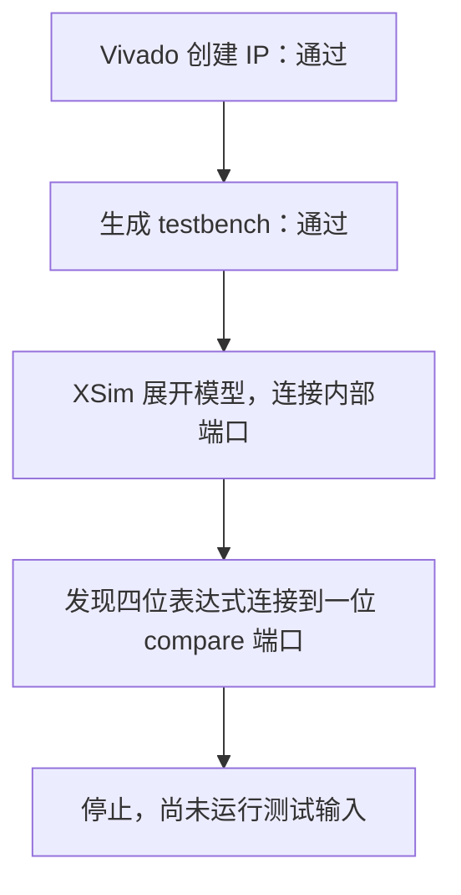

# TMR 投票器：锁步模式带比较器时，仿真在开始运行前报错

Vivado 2026.1 可以生成下面两组 IP，但 XSim 展开仿真模型时发现内部端口位宽不匹配。
测试还没有送入功能输入，所以本条记录的是“该配置无法开始仿真”。

## TMR 和锁步是什么

TMR 的意思是把一份电路做成三份，让三份执行同样的任务，
再按多数结果决定输出。对单个二进制位来说：

| 三份电路的结果 | 多数结果 |
| --- | --- |
| 0、0、1 | 0 |
| 1、0、1 | 1 |
| 1、1、1 | 1 |

多数投票可以写成 `Y=(A AND B) OR (A AND C) OR (B AND C)`。
AND 表示两个输入都为 1 才得 1，OR 表示至少一个为 1 就得 1。
多位数据通常逐位执行这个规则。

本次选的是双份锁步模式：两份电路执行相同任务，比较结果是否一致。
两份意见不同时没有“多数”，所以主要用于发现差异。
[PG268](https://docs.amd.com/r/en-US/pg268-tmr/Lockstep-Fail-Safe-Configuration)
说明这个模式仍会使用 TMR Voter 分配输入信号。
名称里有 Voter，不代表本次是在做三选二的多数投票。

## 失败配置的每个参数

| 参数 | 含义 | `voter_lockstep1` | `voter_lockstep_reg17` |
| --- | --- | --- | --- |
| `triple` | 三份冗余还是锁步 | false，锁步 | false，锁步 |
| `comparator` | 是否启用内置比较器 | true | true |
| `width` | 每组离散输入有多少位 | 1 | 17 |
| `input_register` | 输入是否先经过一级寄存器 | false | true |
| `voter_check` | 是否启用投票器自检查 | false | false |
| `disable_port` | 是否带外部关闭 TMR 的控制端口 | false | false |
| `include_mask` | 参与比较的选择掩码 | `0xFFFFFFFFFFFFFFFF` | `0xFFFFFFFFFFFFFFFF` |

“离散输入”指直接连接的一组信号位，而不是一套 AXI 总线。
掩码是按位选择的配置，本次为全 1。
[PG268 参数表](https://docs.amd.com/r/en-US/pg268-tmr/User-Parameters)给出了模式、
比较器和掩码选项。

## 仿真停在哪一步

“展开”是仿真器把模块和端口连接起来、准备运行的步骤，不是综合。
可以类比为核对接口尺寸：一处提供四根逻辑线，另一处只接收一根，
连接规则又没有完成相应转换，于是仿真器拒绝继续。

日志指向厂商文件 `tmr_voter_v1_0_rfs.vhd:16720`。
自动化的两组配置均失败，固定独立 VHDL 也复现了这一报错。

这支持向厂商询问该组合的模型生成或端口连接问题。
由于尚未运行输入，不能声称已证明它把某个投票结果算错。

[独立 VHDL](../../../tests/fixtures/ip/tmr_voter/tb_lockstep_probe.vhd)、
[报错日志](../../../evidence/vivado_2026_1/observations/2026-09-22_12-24-06_UTC+0800_1725142/tmr_voter/literal_probe_sim.process.log)
和[两组参数报告](../../../evidence/vivado_2026_1/full_regression/2026-09-22_12-47-30_UTC+0800_4bca4f69/report.csv)
可分别查看复现输入框架、厂商报错原文和参数。
